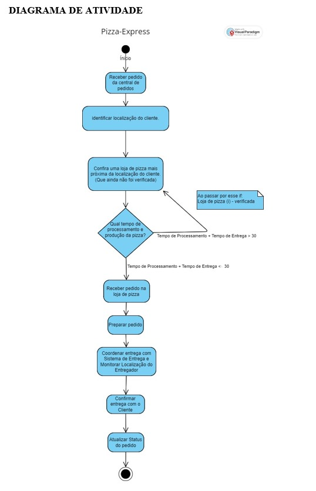
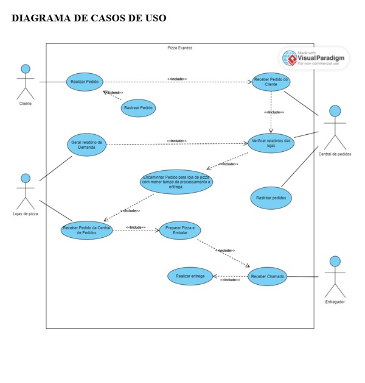
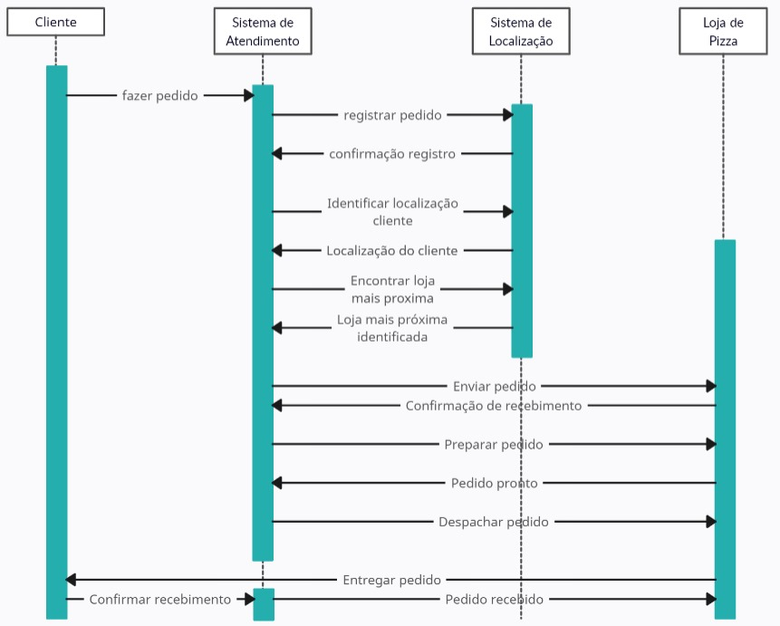
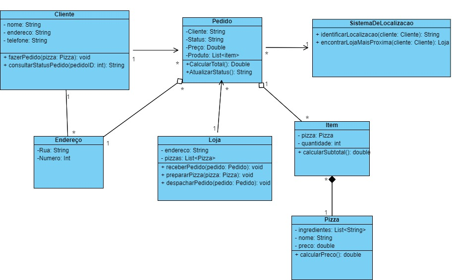
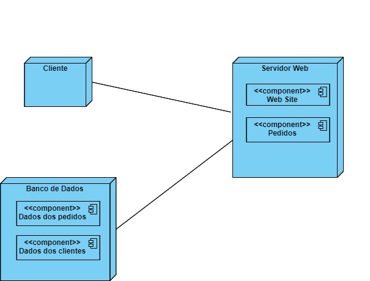

<h2><a href= "https://www.mackenzie.br">Universidade Presbiteriana Mackenzie</a></h2>

# Template para Disciplina de Engenharia de Software

# Projeto: Pizza Planet

# Grupo: Jogador Solo

# Descrição
- O objetivo é desenvolver um sistema de software para a Pizza-Express, no qual possui uma perda de rendimento devido à concorrência que oferece entrega em 30 minutos.
- O primeiro é um sistema de software para o atendimento do pedido e para encontrar localização da fábrica da pizza mais próxima do cliente para fazer a entrega;
- E o segundo é um sistema de software para suportar operações da fábrica de pizzas.
- O sistema irá verificar o tempo de processamento da pizza com base nas demandas das lojas de pizza, e o tempo que o entregador levará para chegar à localização do cliente: 
(Tempo de Processamento + Tempo de Entrega <30)
Garantindo assim que o cliente irá receber sua pizza em menos de 30 minutos.

- ## Requisitos do Sistema de Atendimento de Pedidos e Localização de Fábrica de Pizzas

- Rastreamento de Localização: O sistema deve ser capaz de identificar a localização do cliente e encontrar a fábrica de pizza Pizza-Express mais próxima para entrega.
-	Entrada de Pedidos: Deve permitir que os clientes façam pedidos de pizzas de forma rápida e eficiente.
-	Integração com Central de Pedidos: Os pedidos dos clientes devem ser recebidos e processados por uma central de pedidos, que os encaminhará para a fábrica de pizza mais próxima.
-	Verificação de Demanda: As demandas em cada loja devem ser computadas na central para garantir que nenhuma seja sobrecarregada.
-	Tempo de Processamento: O sistema deve garantir que o tempo de processamento do pedido, incluindo a preparação da pizza + o tempo de entrega não exceda os 30 minutos.
-	Rastreamento de Pedidos: Os clientes devem poder rastrear o status do pedido, desde a entrada até a entrega.

- ## Requisitos do Sistema de Operações da Fábrica de Pizzas

-	Gestão de Pedidos: O sistema deve gerenciar os pedidos recebidos da central de pedidos e garantir sua preparação rápida e precisa.
-	Rastreamento de Tempo: Rastrear o tempo de preparação de cada pedido para garantir que os prazos de entrega sejam cumpridos.
-	Gestão de Entrega: Coordenar com o sistema de entrega para garantir que as pizzas sejam entregues dentro do prazo estabelecido.
-	Relatórios de Desempenho: Gerar relatórios de desempenho para análise de eficiência operacional e identificação de áreas de melhoria.

# Conteúdo

- [Autores](#autores)
- [Descrição do projeto](#)
- [Diagrama_de_atividade](#Diagrama_de_atividade)
- [DESCRIÇÃO CASOS DE USO](#DESCRIÇÃO CASOS DE USO)
- 
- 
- 
- 
- 
-  

# Autores

* Lucas Bittencourt de Oliveira - TIA 42219851/RA 10409476

# Releases
- ## Diagrama de atividade
- 
  
- ## Requisitos do Sistema de Atendimento de Pedidos e Localização de Fábrica de Pizzas
- Rastreamento de Localização: O sistema deve ser capaz de identificar a localização do cliente e encontrar a fábrica de pizza Pizza-Express mais próxima para entrega.
- Entrada de Pedidos: Deve permitir que os clientes façam pedidos de pizzas de forma rápida e eficiente.
- Integração com Central de Pedidos: Os pedidos dos clientes devem ser recebidos e processados por uma central de pedidos, que os encaminhará para a fábrica de pizza mais próxima.
- Verificação de Demanda: As demandas em cada loja devem ser computadas na central para garantir que nenhuma seja sobrecarregada.
- Tempo de Processamento: O sistema deve garantir que o tempo de processamento do pedido, incluindo a preparação da pizza + o tempo de entrega não exceda os 30 minutos.
- Rastreamento de Pedidos: Os clientes devem poder rastrear o status do pedido, desde a entrada até a entrega.

- ## Requisitos do Sistema de Operações da Fábrica de Pizzas
- Gestão de Pedidos: O sistema deve gerenciar os pedidos recebidos da central de pedidos e garantir sua preparação rápida e precisa.
- Rastreamento de Tempo: Rastrear o tempo de preparação de cada pedido para garantir que os prazos de entrega sejam cumpridos.
- Gestão de Entrega: Coordenar com o sistema de entrega para garantir que as pizzas sejam entregues dentro do prazo estabelecido.
- Relatórios de Desempenho: Gerar relatórios de desempenho para análise de eficiência operacional e identificação de áreas de melhoria.

- 
  
- ## DESCRIÇÃO CASOS DE USO
- Caso de Uso: Realizar Pedido                                       
Descrição: Permite ao cliente realizar um pedido de pizza.
- Caso de Uso: Rastrear Pedido                                               
Descrição: Permite ao cliente rastrear o status do seu pedido caso tenha realizado um.
- Caso de Uso: Receber Pedido da Central de Pedidos                          
Descrição: Permite as lojas de pizza receber pedidos da central.       
- Caso de Uso: Preparar Pizza e Embalar                                      
Descrição: Permite as lojas de pizza prepararem a pizza caso tenha recebido um pedido.
- Caso de Uso: Gerar relatório de Demanda
Descrição: Permite as lojas de pizza enviarem um relatório para a central com suas atuais demandas, para análise do tempo de processo e preparo de um subsequente pedido.
- Caso de Uso: Receber pedido do Cliente
Descrição: Permite a central de pedidos receber as informações quando o cliente realizar o pedido.
- Caso de Uso: Verificar Relatórios das lojas
Descrição: Permite a central de pedidos visualizar os relatórios entregues pelas lojas de pizza.
- Caso de Uso: Encaminhar Pedido para loja de pizza com menor tempo de processamento e entrega.
Descrição: Permite que após verificar relatórios das lojas, a central de pedidos decida para qual unidade irá enviar o pedido com base no cálculo: 
(Tempo de Processamento + Tempo de Entrega <30)
- Caso de Uso: Rastrear pedidos
Descrição: Permite que a central de pedidos possa rastrear e acompanhar os pedidos dos clientes.
- Caso de Uso: Receber Chamado
Descrição: Permite que o entregador receba um chamado após a loja de pizza preparar e embalar o pedido do cliente.
- Caso de Uso: Realizar Entrega
Descrição: Este caso de uso permite que o entregador realize a entrega para a qual foi chamado.

- ## Diagrama de Sequencia
- 

- ## Diagrama de Classes
- 

- ## Diagrama de Implementação
- 

        

