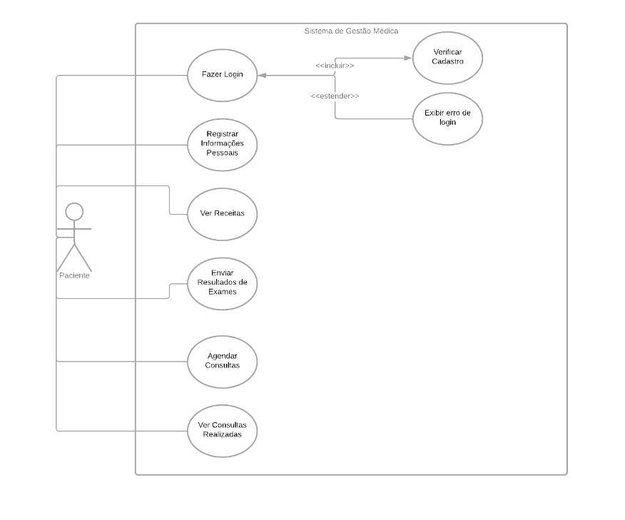
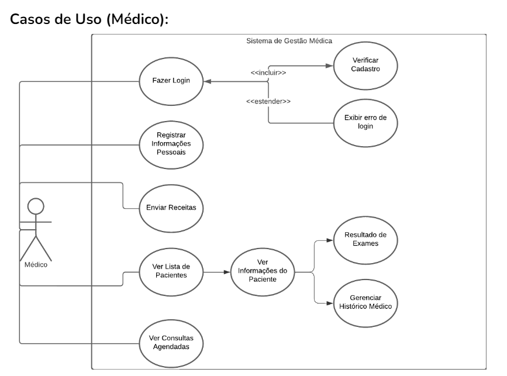

<h2><a href= "https://www.mackenzie.br">Universidade Presbiteriana Mackenzie</a></h2>
<h3><a href= "https://www.mackenzie.br/graduacao/sao-paulo-higienopolis/sistemas-de-informacao">Sistemas de Informação</a></h3>

*&lt;Inovação na Gestão Médica: Rumo a uma Saúde mais Eficiente e Segura&gt;*

**Conteúdo**

- [Autores](#autores)
- [Descrição do projeto](#descrição-do-projeto)
- [Definição de demanda de desenvolvimento](#definição-de-demanda-de-desenvolvimento)
- [Diagrama de casos de uso](#diagrama-de-casos-de-uso)
- [Descrição dos casos de uso](#descrição-dos-casos-de-uso)

# Autores

* Lucas Bittencourt de Oliveira

# Descrição do projeto

*O "Sistema de Gestão Médica” é uma aplicação de software desenvolvida para auxiliar médicos e pacientes na organização, armazenamento e acesso seguro a informações médicas, históricos de pacientes, prescrições, resultados de exames e outras funcionalidades relacionadas à área da saúde.*

# Diagrama de casos de uso

## Paciente

## Medico

# Descrição dos casos de uso

## Paciente

**Login do Paciente:**

- *Ator Principal:* Paciente
- *Descrição:* O paciente realiza login no sistema utilizando suas credenciais. Em caso de sucesso, tem acesso às funcionalidades do sistema; caso contrário, uma mensagem de erro é exibida.

**Registro de Informações Pessoais:**

- *Ator Principal:* Paciente
- *Descrição:* O paciente pode inserir e atualizar suas informações pessoais, como nome, data de nascimento, sexo, endereço, número de telefone, RG e informações de contato de emergência.

**Ver Receitas:**

- *Ator Principal:* Paciente
- *Descrição:* O paciente visualiza prescrições médicas anteriores, incluindo data, médico responsável e medicamentos prescritos.

**Enviar Resultados de Exames:**

- *Ator Principal:* Paciente
- *Descrição:* O paciente faz upload de resultados de exames para compartilhar com seu médico, facilitando a comunicação entre eles.

**Agendar Consultas:**

- *Ator Principal:* Paciente
- *Descrição:* O paciente agenda consultas com médicos disponíveis, escolhendo motivo, data e horário desejados.

**Ver Consultas Realizadas:**

- *Ator Principal:* Paciente
- *Descrição:* O paciente visualiza suas consultas prévias com os médicos.

## Medico

**Caso de Uso: Login do Médico**

- *Ator Principal:* Médico
- *Descrição:* O médico faz login no sistema utilizando seu código de acesso. Em caso de sucesso, tem acesso às funcionalidades do sistema; caso contrário, uma mensagem de erro é exibida.

**Caso de Uso: Registro de Informações Pessoais do Médico**

- *Ator Principal:* Médico
- *Descrição:* O médico insere e atualiza suas informações pessoais, como nome, idade, área de atuação, e outras informações relevantes.

**Caso de Uso: Gerenciamento de Pacientes**

- *Ator Principal:* Médico
- *Ator Secundário:* Paciente
- *Descrição:* O médico acessa e atualiza as informações pessoais e médicas de seus pacientes, incluindo nome, idade, sexo, RG, doenças pré-existentes, alergias e histórico familiar.

**Caso de Uso: Prescrição de Receitas**

- *Ator Principal:* Médico
- *Ator Secundário:* Paciente
- *Descrição:* O médico prescreve medicamentos e faz o upload da receita para o paciente, incluindo informações sobre a medicação e a dosagem.

**Caso de Uso: Gerenciamento de Medicamentos**

- *Ator Principal:* Médico
- *Descrição:* O médico busca e filtra medicamentos por tipo e nome, auxiliando na prescrição de medicamentos.

**Caso de Uso: Agenda de Consultas**

- *Ator Principal:* Médico
- *Ator Secundário:* Paciente
- *Descrição:* O médico visualiza sua agenda de consultas, incluindo os horários marcados com os pacientes, facilitando o gerenciamento de consultas e atendimentos.